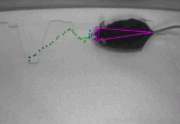

# DeepWebCut
**Work in progress**  
Thanks to the great repository
[DeepLabCut](https://github.com/DeepLabCut/DeepLabCut) and the great idea from
[this feature request](https://github.com/DeepLabCut/DeepLabCut/issues/1129), I
have started this project to create a web-based version of DeepLabCut named
DeepWebCut. 

DeepLabCut can make pose estimations for animals with very few labels.
A couple of graphics copied directly from DeepLabCut:

**The goal:**  
Homepage allow video upload (or recording w/ camera from smartphone) and
subsequent labeling. Then trains model and allow sharing trained model through
link. Opening the link automatically opens camera on smartphone and runs
mobilenet version of model for live tracking.

## Contributions
Contributions are very welcome.

